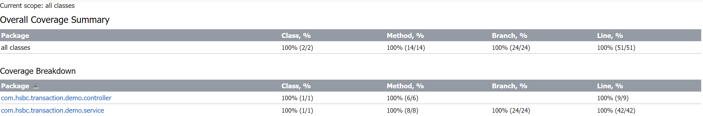

## 项目说明
 银行交易系统的demo工程
 
## 涉及的技术栈

 | 技术栈      | 版本描述      |
 |----------|-----------|
| jdk      | OpenJDK21 |
| springboot | 3.2.3     |

## 功能说明
1.提供交易类的创建，删除，修改，单个查询，分页查询基础的功能\
2.本项目无持久化数据库，通过Map集合简单替代持久化数据库\
3.本项目暂时使用Map这种内存作为数据库支持

## 外部依赖项
org.springframework.boot:spring-boot-starter-web:3.2.3          提供web容器\
org.springframework.boot:spring-boot-starter-validation:3.2.3   用作请求参数校验\
org.springframework.boot:spring-boot-starter-test:3.2.3         用作单元测试\

## 启动方式
idea本地启动：默认端口：8080
启动类路径：com.hsbc.transaction.demo.DemoApplication

## 单元测试
测试类路径：com.hsbc.transaction.demo.controller.TransactionControllerTest\
测试报告:

## 后续优化点
1.由于是采用内存数据库，故暂时未使用缓存做性能优化，
  后续可以根据实际的QPS综合考虑做Caffeine/分布式缓存多层缓存优化